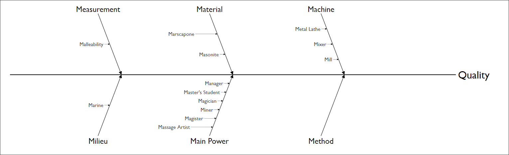
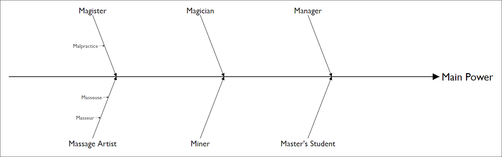
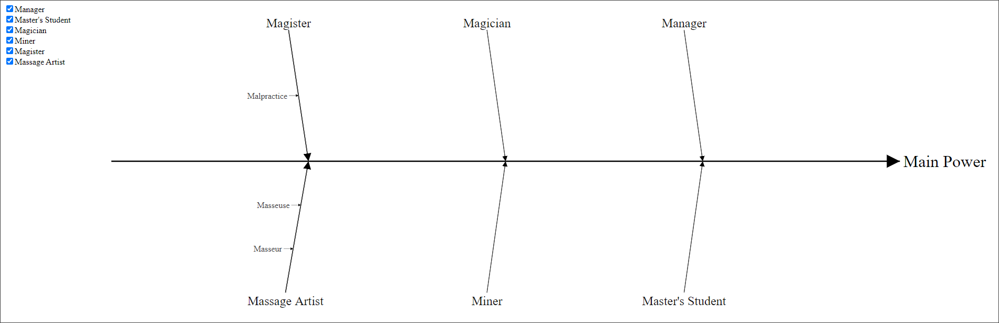

Fishbone Diagram
===
## Description

This fishbone diagram refactor the [d3 fishbone](http://bl.ocks.org/bollwyvl/9239214) and adds some new features. 

* diagram
  * max branches showed
  * depth branches showed
  * hide and show branches 
  * drill down and up
  * resize automatically

* data model


Current implementation supports d3.js __v3__ only.

## A Simple Example

HTML
```html
<div id="fishbone1"></div>
```

JavaScript
```javascript

// 1. chart
let diagram = uia.fishbone.chart("fishbone1", "100%", "600")
    .depth(2)
    .maxBranches([5, 3]); // [depth=0, depth=1]

// 2. data model
var quality = uia.fishbone.data("Quality");
var machine = quality
    .add("Machine")
        .leaf("Mill")
        .leaf("Mixer")
        .leaf("Metal Lathe")
var method = quality
    .add("Method", false);  // do not show this branch
var material = quality
    .add("Material");
material
    .leaf("Masonite")
    .add("Marscapone")
        .leaf("Malty")
        .add("Minty")
            .leaf("spearMint")
            .leaf("pepperMint");
var mainPower = quality
    .add("Main Power")
        .leaf("Manager")
        .leaf("Master's Student")
        .leaf("Magician")
        .leaf("Miner");
mainPower.add("Magister")
            .leaf("Malpractice");
mainPower.add("Massage Artist")
    .leaf("Masseuse")
    .leaf("Masseur");
var measurement = quality
    .add("Measurement")
        .leaf("Malleability");
var milieu = quality
    .add("Milieu")
    .leaf("Marine");

// 3. bind to diagram
quality.build(diagram);

```

## Test Cases
### fishbone-test-v3.html


1. Top Overview
2. 
    

3. Hide __Method__ Branch
4. 
    

5. Drill Down to __Main Power__
6. 
    


## What Next
* Support d3.js __v6__.
 
## References

* [d3 fishbone](http://bl.ocks.org/bollwyvl/9239214)